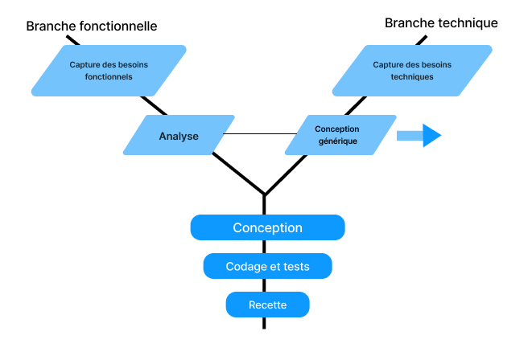
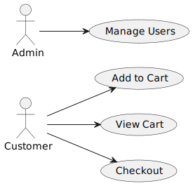

        
        

> ## Projet E-Commerce 

**Présenté par** : Zakaria Azizi

**Encadré par** : ESSARRAJ Fouad

|||
> ### 1. Introduction : 

|||

> ### 2. Méthode de travail:

- 2.1. Scrum
- 2.2. 2TUP
- 2.3. Ux design

|||
> #### 2.1. Scrum:

|||
> #### 2.2. 2TUP:

|||
> #### 2.3. Design Thinking:

|||
> ### 3. Planification :

#### 3.1. Planification détaillée:
<table style="font-size: 28px; border-collapse: collapse; width: 100%;">
  <thead>
    <tr>
      <th style="border: 1px solid grey; padding: 8px;">Semaine 1</th>
      <th style="border: 1px solid grey; padding: 8px;">1</th>
      <th style="border: 1px solid grey; padding: 8px;">2</th>
      <th style="border: 1px solid grey; padding: 8px;">3</th>
    </tr>
  </thead>
  <tbody>
    <tr>
      <td style="border: 1px solid grey; padding: 8px;">Lundi</td>
      <td style="border: 1px solid grey; padding: 8px;">Planification</td>
      <td style="border: 1px solid grey; padding: 8px;">Auto-formation</td>
      <td style="border: 1px solid grey; padding: 8px;">Auto-formation</td>
    </tr>
    <tr>
      <td style="border: 1px solid grey; padding: 8px;">Mardi</td>
      <td style="border: 1px solid grey; padding: 8px;">-</td>
      <td style="border: 1px solid grey; padding: 8px;">-</td>
      <td style="border: 1px solid grey; padding: 8px;">Atelier</td>
    </tr>
    <tr>
      <td style="border: 1px solid grey; padding: 8px;">Mercredi</td>
      <td style="border: 1px solid grey; padding: 8px;">Atelier</td>
      <td style="border: 1px solid grey; padding: 8px;">Atelier</td>
      <td style="border: 1px solid grey; padding: 8px;">Atelier</td>
    </tr>
    <tr>
      <td style="border: 1px solid grey; padding: 8px;">Jeudi</td>
      <td style="border: 1px solid grey; padding: 8px;">Projet fil rouge</td>
      <td style="border: 1px solid grey; padding: 8px;">Prototype</td>
      <td style="border: 1px solid grey; padding: 8px;">Prototype</td>
    </tr>
    <tr>
      <td style="border: 1px solid grey; padding: 8px;">Vendredi</td>
      <td style="border: 1px solid grey; padding: 8px;">Prototype</td>
      <td style="border: 1px solid grey; padding: 8px;">Base de données</td>
      <td style="border: 1px solid grey; padding: 8px;">-</td>
    </tr>
  </tbody>
</table>

|||

#### 3.1. Planification détaillée:
<table style="font-size: 28px; border-collapse: collapse; width: 100%;">
  <thead>
    <tr>
      <th style="border: 1px solid grey; padding: 8px;">Semaine 2</th>
      <th style="border: 1px solid grey; padding: 8px;">1</th>
      <th style="border: 1px solid grey; padding: 8px;">2</th>
      <th style="border: 1px solid grey; padding: 8px;">3</th>
    </tr>
  </thead>
  <tbody>
    <tr>
      <td style="border: 1px solid grey; padding: 8px;">Lundi</td>
      <td style="border: 1px solid grey; padding: 8px;">Maquettes</td>
      <td style="border: 1px solid grey; padding: 8px;">Maquettes</td>
      <td style="border: 1px solid grey; padding: 8px;">Maquettes</td>
    </tr>
    <tr>
      <td style="border: 1px solid grey; padding: 8px;">Mardi</td>
      <td style="border: 1px solid grey; padding: 8px;">-</td>
      <td style="border: 1px solid grey; padding: 8px;">-</td>
      <td style="border: 1px solid grey; padding: 8px;">Réalisation</td>
    </tr>
    <tr>
      <td style="border: 1px solid grey; padding: 8px;">Mercredi</td>
      <td style="border: 1px solid grey; padding: 8px;">Réalisation</td>
      <td style="border: 1px solid grey; padding: 8px;">Réalisation</td>
      <td style="border: 1px solid grey; padding: 8px;">Réalisation</td>
    </tr>
    <tr>
      <td style="border: 1px solid grey; padding: 8px;">Jeudi</td>
      <td style="border: 1px solid grey; padding: 8px;">Réalisation</td>
      <td style="border: 1px solid grey; padding: 8px;">Réalisation</td>
      <td style="border: 1px solid grey; padding: 8px;">Réalisation</td>
    </tr>
    <tr>
      <td style="border: 1px solid grey; padding: 8px;">Vendredi</td>
      <td style="border: 1px solid grey; padding: 8px;">Réalisation</td>
      <td style="border: 1px solid grey; padding: 8px;">Réalisation</td>
      <td style="border: 1px solid grey; padding: 8px;">-</td>
    </tr>
  </tbody>
</table>

|||
> #### 3.2. Diagramme de Gantt:

|||

> ### 4. Branche technique:

- 4.1. Capture des besoins techniques
- 4.2. Analyse technique
- 4.3. Auto-formation
- 4.4. Conception générique

|||
#### 4.1. Capture des besoins techniques:

- Tailwind CSS
- Ajax
- Laravel
- MySQL

|||

#### 4.2. Analyse technique:

- Laravel avancé
- Application onepage (AJAX)

|||
### 4.3. Apprentissage :

- Blade avancé
- Controllers avancés
- Models avancés
- Repository
- Ajax

|||
### 4.4. Conception générique :

- Voir le produit
- Ajouter un produit
- Supprimer un produit
- Ajax (page unique)
- Repository

|||

> ### 5. Branche fonctionnelle

- 5.1. Carte d’empathie 
- 5.2. Definir le probleme
- 5.3. Diagramme de cas d’utilisation general
- 5.4. Diagramme de cas d’utilisation Sprint 1
- 5.5. Diagramme de cas d’utilisation Sprint 2

|||

#### 5.1. Carte d’empathie:

|||
#### 5.2. Definir le probleme:

|||
#### 5.3. Diagramme de cas d’utilisation general:

|||
#### 5.4. Diagramme de cas d’utilisation Sprint 1:

|||
#### 5.5. Diagramme de cas d’utilisation Sprint 2:

|||
> ### 6. Conception:

- 6.1. Diagramme de classe
- 6.2. Maquette

|||
#### 6.1. Diagramme de classe:

|||

#### 6.2. Maquette:

|||
> ### 7. Réalisation :

|||
> ### 9. Conclusion :

